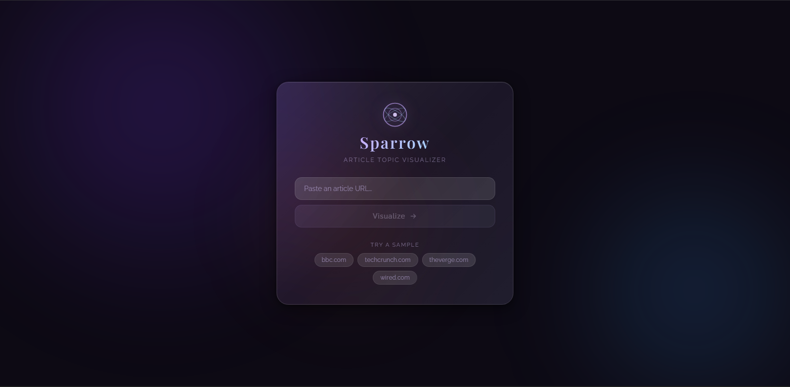
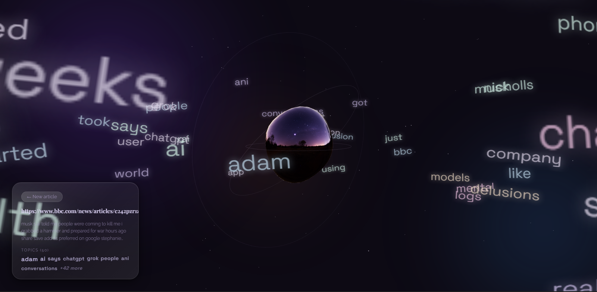

# 3D Article Analyzer

A full-stack app that takes an article URL, extracts the text, and turns it into an interactive 3D word cloud.

---

## 📸 Preview

### Home Page

<!-- Add screenshot here -->

<!--  -->

---

### Analysis View

<!-- Add screenshot here -->


---

## Tech Stack

**Frontend**

* React (Vite)
* Three.js / React Three Fiber
* TypeScript

**Backend**

* Python + FastAPI
* scikit-learn (TF-IDF)
* BeautifulSoup (web scraping)

---

## Recommended Versions

To avoid environment issues, use:

* **Python**: 3.10 – 3.12
* **Node.js**: 18+
* **npm**: 9+

---

## Project Structure

```txt id="2j9c3x"
root/
├── backend/
├──── api/
├────── routes.py
├──── models/
├────── request.py
├────── response.py
├──── pipeline/
├────── analyze_pipeline.py
├──── services/
├────── analyzer.py
├────── cleaner.py
├────── crawler.py
├──── main.py
├──── requirements.txt

├── frontend/
├──── src/
├────── assets/
├────── features/
├──────── wordCloud/
├────────── WordCloudCanvas.tsx
├────── hooks/
├──────── useAnalyze.ts
├────── pages/
├──────── Home.tsx
├────── App.css
├────── App.tsx
├────── index.css
├────── main.tsx
├────── mockData.ts
├── setup.sh
├── setup.bat
└── README.md
```
---
## Website
[Website Here](https://3-d-word-cloud-xavier.vercel.app/)

---

## How to Run

There’s a script to handle setup + startup so you don’t have to manually run two servers.

---

### Windows

1. Open Command Prompt
2. Navigate to the project:

```bash id="2slb3v"
cd path\to\project
```

3. Run:

```bash id="mqkn0r"
setup.bat
```

---

### macOS / Linux

```bash id="pf1qnx"
chmod +x setup.sh
./setup.sh
```

---

## Where to Access

* Frontend → http://localhost:5173
* Backend → http://localhost:8000
* API Docs → http://localhost:8000/docs

---

## API

### POST `/analyze`

**Request**

```json id="ru2jyl"
{
  "url": "https://example.com/article"
}
```

**Response**

```json id="u6qj9b"
{
  "title": "Article Title",
  "summary": "Short summary...",
  "topics": [
    { "word": "AI", "weight": 0.9 },
    { "word": "machine learning", "weight": 0.75 }
  ]
}
```

---

## How the 3D Word Cloud Works

* Articles are fetched and cleaned on the backend
* Text is processed using TF-IDF to extract important terms
* Each word gets a weight based on importance

On the frontend:

* Weight controls size and brightness
* Words are placed in orbit around a central nucleus
* Each word always faces the camera (billboarding)
* Hovering increases scale and glow
* Words fade naturally when moving behind the nucleus

---

## Notes

* Make sure Python and Node/npm are installed
* Backend dependencies are installed into a local `venv`
* Frontend runs via Vite dev server

---

## Why I Didn’t Use Docker

I skipped Docker for this project mainly to keep development fast and simple.

* The app is frontend-heavy (Three.js), so quick iteration mattered more than environment isolation
* There’s no database or external services
* Running locally avoids dealing with container builds and networking during development

If this project were scaled up, for example adding more services, a database, or deploying across environments; Docker would have been a much better fit.

---

## Credits

Built by **Xavier Cruz**
